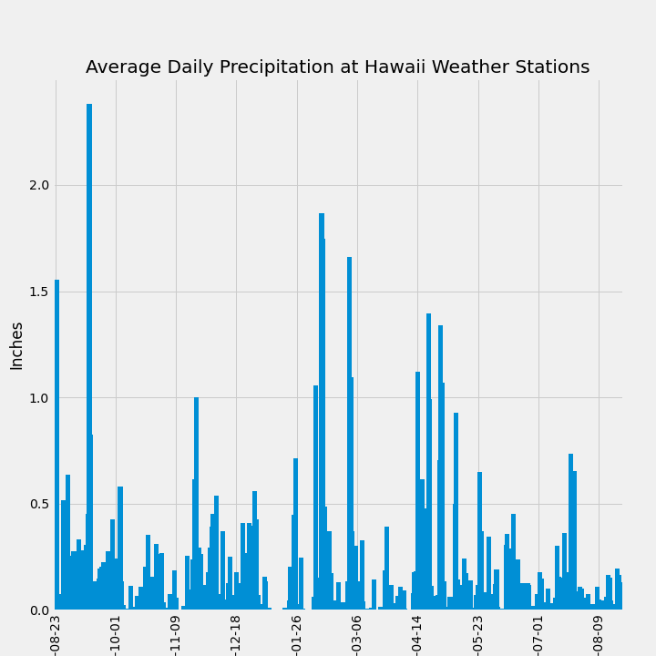
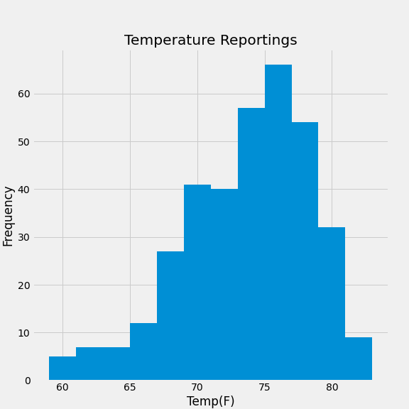
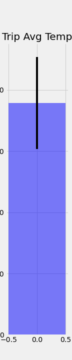
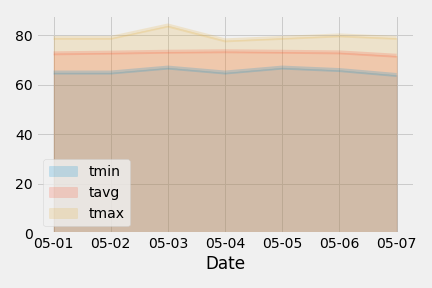

# Hawaii Climate Analysis

## Background
Used Python and SQLAlchemy to do basic climate analysis and data exploration of a Hawaii climate database that contains precipitation and temperature observations across 9 stations. Created a Flask API based on the analysis and SQLAlchemy ORM queries.

## Technologies Used
* Python
* SQLAlchemy
* Panadas
* Matplotlib

## Data Analysis and Exploration
Set up base, created classes for each table and connected to the sqlite database.

```python
# connect to database
engine = create_engine("sqlite:///Resources/hawaii.sqlite")
conn = engine.connect()
session = Session(bind=engine)
inspector = inspect(engine)

# set up Base
Base = declarative_base()

# create classes for measurement and station table
class Measurement(Base):
    __tablename__ = "measurement"
    id = Column(Integer, primary_key=True)
    station = Column(String(30))
    date = Column(Date)
    prcp = Column(Float)
    tobs = Column(Float)


class Station(Base):
    __tablename__ = "station"
    id = Column(Integer, primary_key=True)
    station = Column(String(30))
    name = Column(String(120))
    latitude = Column(Float)
    longitude = Column(Float)
    elevation = Column(Float)
```

### Climate Anaylsis: 
Obtained the last 12 months of precipiation data, converted into a dataframe, and plotted a bar chart.

```python
# design a query to retrieve the last 12 months of precipitation data and plot the results
query = (
    session.query(Measurement.date, func.avg(Measurement.prcp))
    .filter(Measurement.date >= start_date)
    .filter(Measurement.date <= end_date)
    .group_by(Measurement.date)
)

# save the query results as a Pandas DataFrame and set the index to the date column
prcp_df = (
    pd.read_sql(query.statement, query.session.bind, index_col="date")
    .rename(columns={"avg_1": "precipitation"})
    .sort_index()
)

# using Pandas plotting with Matplotlib to plot the data
prcp_df.plot(
    kind="bar",
    title="Average Daily Precipitation at Hawaii Weather Stations",
    figsize=(10, 10),
    width=3,
    legend=False,
)
plt.locator_params(axis="x", nbins=9.5)
plt.xlabel("Date")
plt.ylabel("Inches")
plt.savefig("Images/precipitation_bar.png")
plt.show()
```



### Station Analysis: 
Calculated total number of stations, found the most active stations by highest number of observations, obtained the last 12 months of temperature data for the most active station, and converted to a dataframe to plot a histogram

```python
# query to show how many stations are available in this dataset
num_station_measurement = len(session.query(Measurement.station).distinct().all())

num_station = len(session.query(Station.station).distinct().all())

# find the most active station

active_station = (
    session.query(Measurement.station, func.count(Measurement.station))
    .group_by(Measurement.station)
    .order_by(func.count(Measurement.station).desc())
)

# get the last 12 months of temperature observation data for station USC00519281
min_date, max_date = (
    session.query(func.min(Measurement.date), func.max(Measurement.date))
    .filter(Measurement.station == "USC00519281")
    .first()
)

start_date = max_date - relativedelta(years=1)
end_date = max_date

query = (
    session.query(Measurement.date, Measurement.tobs)
    .filter(Measurement.station == "USC00519281")
    .filter(Measurement.date >= start_date)
    .filter(Measurement.date <= end_date)
)

# convert to a dataframe
temp_df = (
    pd.read_sql(query.statement, query.session.bind, index_col="date")
    .rename(columns={"tobs": "temperature"})
    .sort_index()
)

# plot a histogram of the results
temp_df.plot(
    kind="hist", title="Temperature Reportings", bins=12, legend=False, figsize=(8, 8)
)
plt.xlabel("Temp(F)")
plt.ylabel("Frequency")
plt.savefig("Images/histogram.png")
plt.show()
```


### Temperature Analysis:
Analyzed min, max and avg temperatures for a specific date range using previous years data. Plotted the min, max and avg temperatures from the query on a bar chart.

```python
# create a function that will accept start date and end date, returning the min, avg and max temps for a date range
def calc_temps(start_date, end_date):
    """TMIN, TAVG, and TMAX for a list of dates.
    
    Args:
        start_date (string): A date string in the format %Y-%m-%d
        end_date (string): A date string in the format %Y-%m-%d
        
    Returns:
        TMIN, TAVE, and TMAX
    """

    return (
        session.query(
            func.min(Measurement.tobs),
            func.avg(Measurement.tobs),
            func.max(Measurement.tobs),
        )
        .filter(Measurement.date >= start_date)
        .filter(Measurement.date <= end_date)
        .all()
    )

# using function `calc_temps` to calculate the tmin, tavg, and tmax for date range using the previous year's data for those same dates.
prev_year_start = dt.date(2018, 5, 1) - dt.timedelta(days=365)
prev_year_end = dt.date(2018, 5, 7) - dt.timedelta(days=365)

tmin, tavg, tmax = calc_temps(
    prev_year_start.strftime("%Y-%m-%d"), prev_year_end.strftime("%Y-%m-%d")
)[0]

# plot the results in a bar chart and use the peak-to-peak (tmax-tmin) value as the y error bar (yerr)
tmin = t[0][0]
tavg = t[0][1]
tmax = t[0][2]
yerr = tmax - tmin

plt.figure(figsize=(2, 10))
plt.bar(0, tavg, yerr=yerr, align="center", width=1, color="blue", alpha=0.5)
plt.ylim = (0, 100)
plt.ylabel("average temperature(F)")
plt.title("Trip Avg Temp")
plt.savefig("Images/avg_temp.png")
plt.show()
```



### Daily Rainfall Average:
Calculated the rainfall per weather station using the years previous matching for the date range.

```python
# calculate the rainfall per weather station using previous year's matching dates
start_date = "2017-05-01"
end_date = "2017-05-07"

sel = [
    Station.station,
    Station.name,
    Station.latitude,
    Station.longitude,
    Station.elevation,
    func.sum(Measurement.prcp),
]

results = (
    session.query(*sel)
    .filter(Measurement.station == Station.station)
    .filter(Measurement.date >= start_date)
    .filter(Measurement.date <= end_date)
    .group_by(Station.name)
    .order_by(func.sum(Measurement.prcp).desc())
    .all()
)
```
### Daily Temperature Normals:
Calculated the daily minimum, maximum, and average temperatures for the tip date range and the plotted the results on an area plot.

```python
# define daily normals function
def daily_normals(date):
    """Daily Normals.
    
    Args:
        date (str): A date string in the format '%m-%d'
        
    Returns:
        A list of tuples containing the daily normals, tmin, tavg, and tmax
    
    """

    sel = [
        func.min(Measurement.tobs),
        func.avg(Measurement.tobs),
        func.max(Measurement.tobs),
    ]
    return (
        session.query(*sel)
        .filter(func.strftime("%m-%d", Measurement.date) == date)
        .all()
    )

# calculate the daily normals for trip range

trip_start = "2018-05-01"
trip_end = "2018-05-07"

# use the start and end date to create a range of dates
trip_dates = pd.date_range(trip_start, trip_end, freq="D")

trip_month_day = trip_dates.strftime("%m-%d")

# loop through the list of %m-%d strings and calculate the normals for each date
normals = []
for date in trip_month_day:
    normals.append(*daily_normals(date))
normals

# create a dataframe for date range and temp normals
df = pd.DataFrame(normals, columns=["tmin", "tavg", "tmax"])
df["date"] = trip_month_day
df.set_index(["date"], inplace=True)

# create an area plot
df.plot(kind="area", stacked=False, x_compat=True, alpha=0.2)
plt.tight_layout()
plt.xlabel("Date")
plt.savefig("Images/area_plot.png")
plt.ylabel("Temperature")
```




## Flask API Design
Designed a Flask API based on the queries that were developed during the analysis above.

```python
